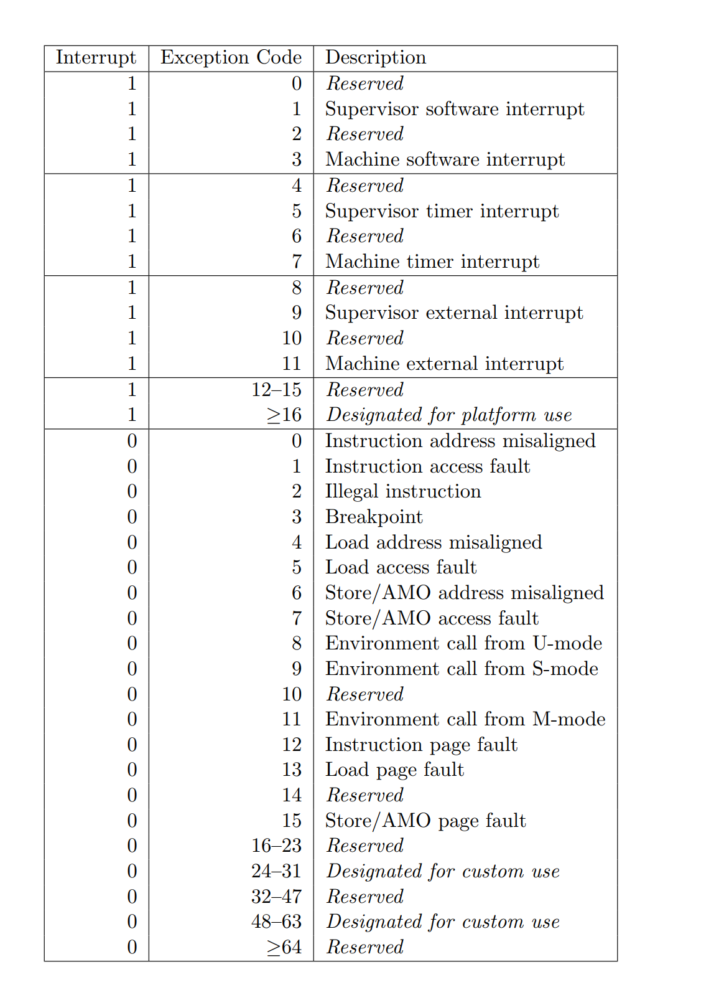
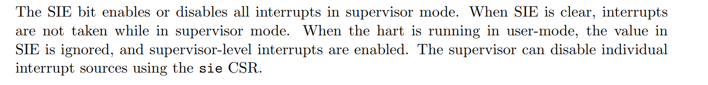

#### Traps : Exception and Interrupt
- Exception : by cpu, **synchronous**
- Interrupt : by other device, **asynchronous**

- All traps are handled by *machine mode* by default, whatever the current mode when trap occurs.
- Set `mideleg` and `medeleg` to delegate the traps to **S-mode**

#### Delegation Rules
- High-privilege happened exception can not be delegated to lower privilege mode.
- Some exceptions can not be delegated to supervisor mode, such as *Environment call from M-mode*.
- Machine interrupts can not be delegated to supervisor mode, such as *machine timer interrupt*.
- >Delegated interrupts result in the interrupt being masked at the delegator privilege level. For example, if the supervisor timer interrupt (STI) is delegated to S-mode by setting mideleg[5], STIs will not be taken when executing in M-mode. By contrast, if mideleg[5] is clear, STIs can be taken in any mode and regardless of current mode will transfer control to M-mode. 
- ...

#### How Environment Call Works

- We delegated the `Environment call from U-mode` to `S-mode`, so we can use `ecall` instruction in user mode to trap into supervisor mode.
- In *xv6*, when trapping into kernel, the `stvev` will be set to `kernelvec` to handle the **trap from kernel**, which is **horizontally** handled.
- In *rustsbi-qemu*, Env-call frome supervisor and Env-call from machine are not delegated, so **we can use sbicall**.

#### sstatus and mstatus
No magic here, just convention.
- When `sret` : return to `sstatus.spp` mode and set `pc = sstatus.sepc`.
- When `mret` : return to `mstatus.mpp` mode and set `pc = mstatus.mepc`.

#### sstatus.sie and mstatus.mie
- When current mode is U-mode, `sstatus.sie` is ignored.
- When current mode is S-mode, interrupts can happen in S-mode when `sstatus.sie` is set.
- `mstatus.mie` is similar to `sstatus.sie`.

#### sstatus.spie
- *Supervisor Previous Interrupt Enable*
- When env-call happens, `sstatus.spie` will save `sstatus.sie` and `sstatus.sie` will be cleared temporarily. (This is done by hardware)
- So **nested interrupts** would not happen by default.
- *vx6* enables `sstatus.sie` when in kernel, so **it can handle the timer interrupt even in S-mode**.

#### SIE and MIE registers
- `sie.ssie`, `sie.stie`, `sie.seie` to control 3 different kind of interrupts. 
- `mie.msie`, `mie.mtie`, `mie.meie`, `mie.ssie`, `mie.stie`, `mie.seie` to control 6 different kind of interrupts.

#### SIP and MIP regsiters
- **Interrupt Pending** registers
- There are also `ssip`, `stip`, `seip`, `msip`, `mtip`, `meip`
- We can manually raise a interrupt by setting the *interrupt pending* regsiters.

#### Timer Delegation
- For some reason, we can **only use the Machine Timer Interrupt**.
- MTI can't be delegated to S-mode.
- Set `mtvec` to a function `mtimer` to manually delegate MTI : by setting `sip`.
  - `xv6` generates a *supervisor software interrupt* : `sip.ssip`
  - `rustsbi-qemu` generates a *supervisor timer interrupt* : `sip.stip`

So when M-mode handles MTI done, the new *supervisor interrupt* would work.

#### Physical Memoery Protection

According to *xv6*, set `pmpaddr0` and `pmpcfg0`.

#### Trap Vector Align
- `Direct` or `Vectored` mode, which is placed at `mtvec` or `stvec`'s **last 2 bits**.
- So **four bytes** aligned is needed for `mtvec` or `stvec`.

#### My Timer Interrupt Implementation

- When in S-mode, interrupt is not allowed, which is promised by `sstatus.sie = 0`. When `sstatus.sie` is clear, trap can not happen when current mode is S-mode, but can interrupt into S-mode when current mode is U-mode. (`sstatus.sie` is ignored when current mode is U-mode)

- When in U-mode, first Machine Timer Interrupt is handled by `mtimer`, then back to U-mode, delegation works, immediately trap into S-mode, which is handled by `stvec`.

Some settings :

- `timer_int()` when in M-mode (booting)
  **M-mode timer handler just set next timer trigger**
  - Make scratch space for `mtimer`
  - set `mtvec` to `mtimer`
  - set `mstatus.mie` and `mie.mtie` to enable MTI in M-mode
- Enable Supervisor Timer Interrupt (only when current mode is U-mode)
  - `mideleg` set befor.
  - `sie.stie` set before.
  - `sstatus.sie` not set, that why STI can not happen when in S-mode.

Further Possible Implementation :

- When in S-mode, we can set `sstatus.sie` to allow interrupt in S-mode (`__save_ctx` has been done), but another `stvec = kerneltrap` is needed to handle the interrupt.
- When `trap_return()`, clear `sstatus.sie` to disable interrupt in S-mode, for preventing interrupt when `__restore_ctx`.